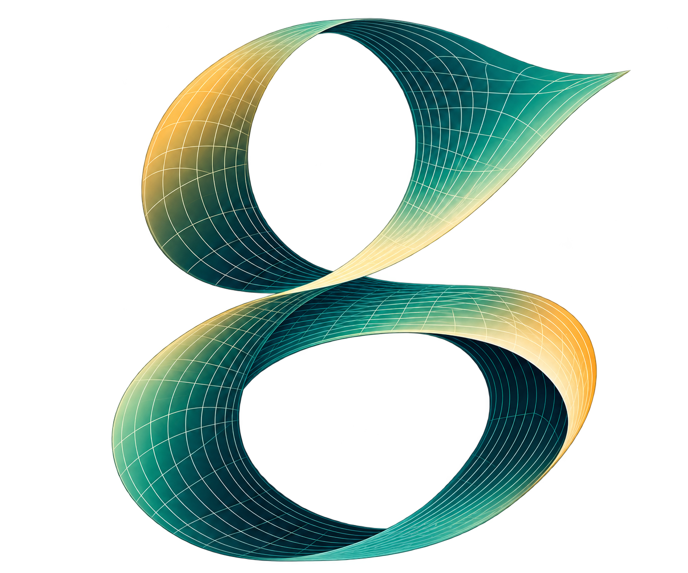

# Genera



Genera is an early-stage numeric Python package for arbitrary-precision computation
with algebraic curves and Abelian functions, particularly for applications in
integrable systems.

Genera uses [mpmath](https://mpmath.org/) for arbitrary-precision arithmetic.
It is an independent project and does not modify the mpmath namespace.
Genera retains the applicable BSD-3-Clause copyright and licence notice.

Example usage:

```python
from genera import Curve, kleinian_sigma, rtheta

curve = Curve({(0, 2): 1, (1, 0): 1, (3, 0): -1})
print(curve.genus)
```

## Development

Create an isolated environment and install the development dependencies:

```sh
python -m venv .venv
.venv/bin/python -m pip install -e '.[develop]'
```

Run the local checks with:

```sh
.venv/bin/ruff check .
.venv/bin/pytest
.venv/bin/pytest --cov=genera --cov-report=term-missing
.venv/bin/sphinx-build -W -b html docs build/sphinx/html
.venv/bin/python -m build
```

Further numerical APIs and documentation will be added incrementally.

## Examples

Literature-based numerical examples live in the repository's `examples/`
directory. They are not installed as part of the `genera` package and do
not require plotting libraries. Run them from a source checkout, for example:

```sh
.venv/bin/python -m examples.manakov.manakov_kleinian_demo
```

The dynamics examples compare their Abelian-function solutions against a
shared arbitrary-precision Runge--Kutta implementation. Lightweight versions
of the examples run in the test suite to keep the published workflows valid.
